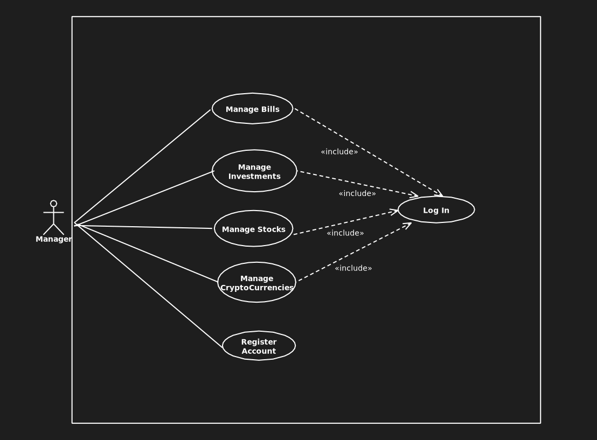
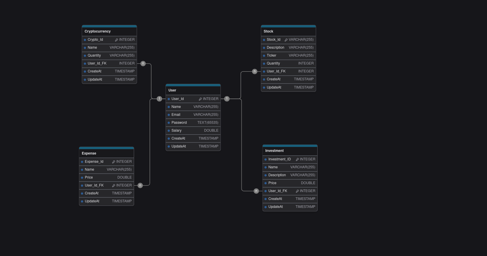

# Capital Mind - Sistema de Controle de Finanças Pessoais

> Em Desenvolvimento

## Visão Geral

O **Capital Mind** é um sistema robusto de controle de finanças pessoais, projetado para simplificar a gestão de despesas, criptomoedas, ações e investimentos. Com foco em eficiência e segurança, o Capital Mind utiliza arquitetura hexagonal, que garante flexibilidade e fácil adaptação às mudanças no sistema, separando claramente as camadas de domínio, aplicação e infraestrutura.

## Funcionalidades

### Para o Usuário:
- **Gerenciar Despesas**: Controle diário de despesas com categorização detalhada.
- **Gerenciar Criptomoedas**: Visualização e administração de portfólios de moedas digitais.
- **Gerenciar Ações**: Acompanhamento e gestão de investimentos em ações.
- **Gerenciar Investimentos**: Planejamento e acompanhamento de diversos tipos de investimentos.
- **Cadastro de Usuário**: Criação de contas para acesso seguro e personalizado.

## Arquitetura

O **Capital Mind** utiliza arquitetura hexagonal, promovendo:
- **Isolamento do Domínio**: O núcleo do sistema está protegido contra mudanças externas.
- **Integração Flexível**: Interfaces permitem fácil substituição de dependências externas, como bancos de dados ou APIs.
- **Testabilidade Melhorada**: A separação de responsabilidades facilita testes unitários e de integração.

## Tecnologias Utilizadas

- **Java 21**
- **Spring Boot 3**:
  - Spring Security
  - Lombok
  - Spring Web
  - Spring Dev Tools
  - Swagger
  - Spring Dotenv
- **Hibernate**
- **Docker**
- **PostgreSQL**

## Diagramas

### Diagrama de Caso de Uso
Este diagrama representa as interações dos usuários com o sistema.  



---

### Modelo Entidade-Relacionamento (MER)
O modelo abaixo detalha a estrutura do banco de dados e os relacionamentos entre as tabelas.  



---

## Como Executar o Projeto

1. Clone este repositório:
   ```
   git clone https://github.com/seu-usuario/capital-mind.git
   ```
2. Certifique-se de ter o **Docker** instalado.
3. No diretório raiz do projeto, execute o seguinte comando:
   ```
   docker-compose up --build
   ```
4. Abra o navegador e acesse
   ```
   http://localhost:8080
   ```
